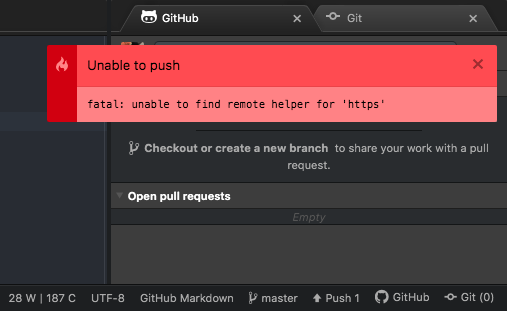
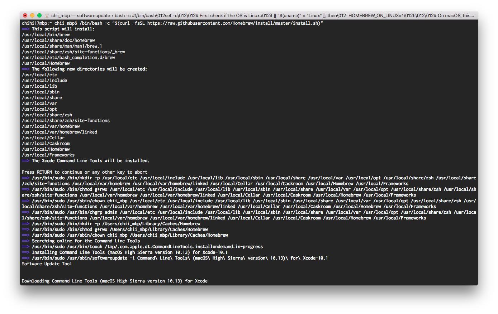
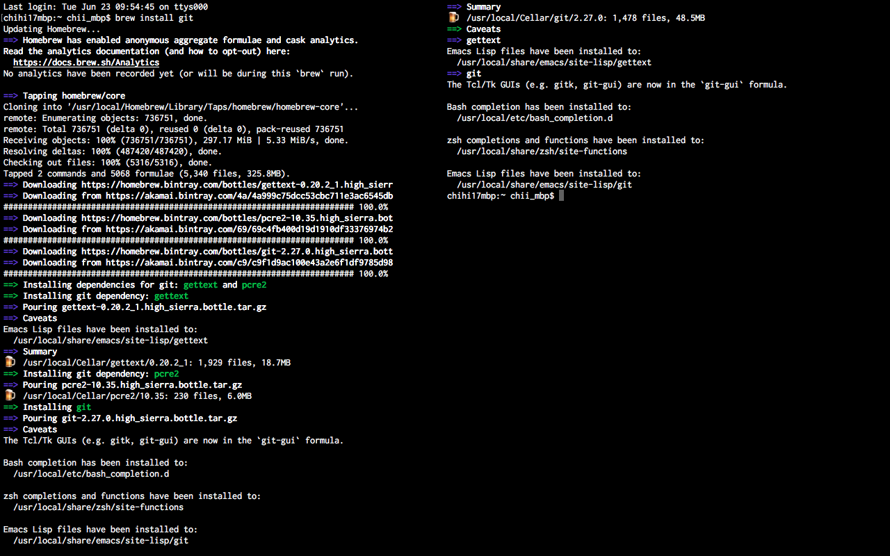

# AtomとGitHubをつなぐ

TIL更新を日常的にするためにも、もっと気軽に行いたい

## Premise

- macOS High Sierra 10.13.6（17G12034）
- [Atom 1.48.0 *64](https://atom.io/)で記入している
- [GitHub](https://github.com/chihi17/til)に保存している

## Result

Atom標準機能で行える

- [atomとgithubを連携させよう](https://www.sejuku.net/blog/73327)
- [atomでgitを使ってみよう](https://www.sejuku.net/blog/73124)

## Trable

gitCommitはできるのに、GitHubにPush出来ない

参考：[Github Error “fatal: Unable to find remote helper for ‘https’”](https://github.com/atom/atom/issues/16655)  
--> gitの一部機能がinstallされていない可能性がある模様

1. [Install Homebrew](https://brew.sh/)

※Homebrewのinstallはなくても対応できるが、  
検索途中で何度も登場し、今後も利用する可能性が高そうなので併せてinstallした。

1. [install git](https://git-scm.com/download/mac)

1. GitHubにpushできたことを確認し、Close
