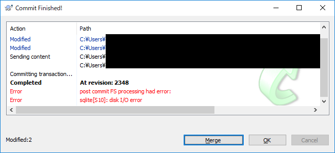
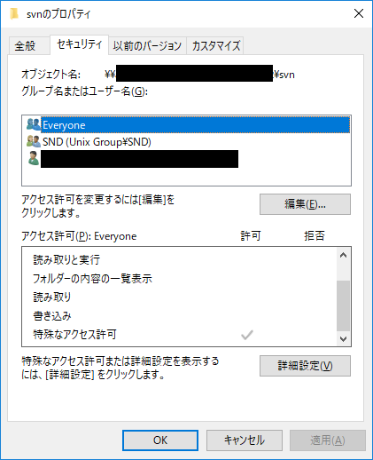
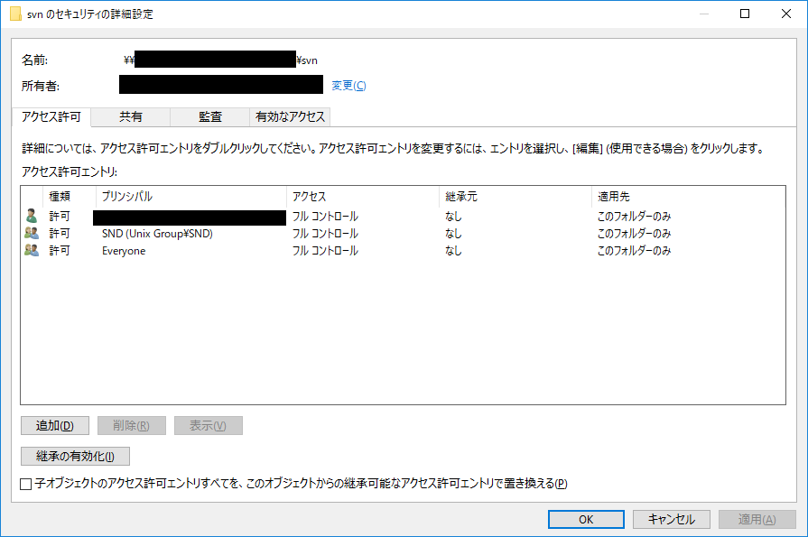

**この記事は調査の途中段階です**

# SVN post commit FS processing had error [S10]

>**Completed: At revision: 2348**
>Error: post commit FS processing had error:  
>Error: sqlite[S10]: disk I/O error

SVN Commit時にError表示が出る。  
Commit後のファイルで特に作業上の問題はない。

## Premise

Windows 10 Pro
>Version 1803  
OS build 17134.345

TortoiseSVN
>TortoiseSVN 1.9.7, Build 27907 - 64 Bit , 2017/08/08 19:34:38
Subversion 1.9.7, -release
apr 1.5.2
apr-util 1.5.4
serf 1.3.9
OpenSSL 1.0.2l  25 May 2017
zlib 1.2.8
SQLite 3.14.1

## Result

## Details

'SVN post commit FS processing had error' は数種類あるらしい。  
[S8]の存在を[確認](http://road-to-tennis.sakura.ne.jp/circles/2017/08/01/%E3%80%90subversion%E3%80%91post-commit-fs-processing-error%E3%81%A8%E5%87%BA%E5%8A%9B%E3%81%95%E3%82%8C%E3%82%8B%E3%82%A8%E3%83%A9%E3%83%BC%E3%81%AB%E3%81%A4%E3%81%84%E3%81%A6/)。
>sqlite[S8]: attempt to write a readonly database

[S10]について
>sudo chmod 664 rep-cache.db

で解決した書き込みあり。  
対する確認結果の記述は同記事にはなし。

**そもそもsqliteって何**  
-->英語翻訳はない。保留。

>Error: sqlite[S10]: disk I/O error

disk I/O error なので外部記憶装置に対する書き込み操作が原因…？
>HDDに物理的な問題があるか、HDDを接続しているケーブル等に問題がある可能性が考えられます。もしHDDの記録面の問題である場合、Windows上でチェックディスクを実行していただくことで解消されることがあります

-->業務環境上、安易に試せないので保留

上記のコマンドの使用例を[調査](http://hchuno.hatenablog.com/entry/20110727/1311841523)。

>>Warning: post-commit FS processing had error 'attempt to write a readonly database'.

>⇒リポジトリのディレクトリにあるrep-cache.dbがrootのみ書き込み可となっていたことが原因

-->SVNリポジトリのディレクトリと権限を確認

少なくともrootのみにはなっていない。

## Trable

## Reference

- [[俺のまとめサイト]:【Subversion】”post commit FS processing had error”と出力されるエラーについて](http://road-to-tennis.sakura.ne.jp/circles/2017/08/01/%E3%80%90subversion%E3%80%91post-commit-fs-processing-error%E3%81%A8%E5%87%BA%E5%8A%9B%E3%81%95%E3%82%8C%E3%82%8B%E3%82%A8%E3%83%A9%E3%83%BC%E3%81%AB%E3%81%A4%E3%81%84%E3%81%A6/)

- [[myChuno::blog]:Subversionのインストール、その他諸々。](http://hchuno.hatenablog.com/entry/20110727/1311841523)
